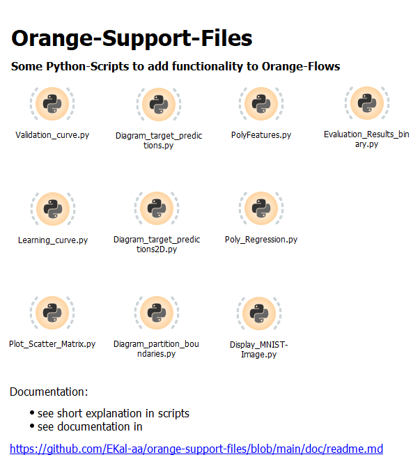

# orange-support-files
Some scripts to extend functionality to Orange, a machine learning and data visualization software from https://orangedatamining.com

[Some documentation for the scripts](https://github.com/EKal-aa/orange-support-files/blob/main/doc/readme.md)

Orange is a software suitable to teach many aspects of machine learning. In many cases, the students don't need to code themself. Instead, they place components on a canvas with different functionality and connect the components to create data flows.

These workflows with components and connections are easily extendable with own Python scripts to add functionality. Here are some of my scripts, which help to make clear different aspects in machine learning:
* display a validation curve
* display a learning curve
* display a scatter matrix plot
* generate polynomial and interaction features out of the existing ones (for example to use linear regression for modeling nonlinear functions)
* create a learner (and trained model) for polynomial regression
* display partition boundarys for classification with two numeric features (for example to visualize overfitting)
* display numerical data for regression in 2D- and 3D-diagrams with targets and predictions (for example to visualize overfitting)
* display an image of a selectable handwritten number out of the MNIST dataset

All are written for the direct use in my lectures. Some are inspired or adapted from Textbooks.

## Usage
- Download the Zip file of this repository. (click the green button "Code", than "Download ZIP". Decompress Zip file.
- Open the file (with the highest version number) in folder ows-files with orange (and store it in a place convinient for you).
- Copy and paste a widget in your own orange canvas.

