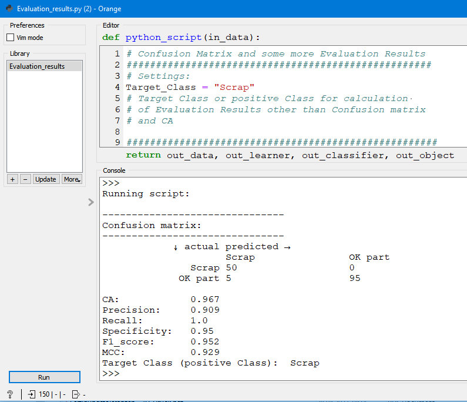

# Evaluation_Results.py
Computes a confusion matrix and the performance criteria 
- CA
- Precision
- Recall
- Specificity
- F1_score and
- MCC (Matthews correlation coefficient; https://en.wikipedia.org/wiki/Phi_coefficient)

for a binary or multiclass classification.

When a learner is used to make binary classification, and when a custom decision threshold (other than 0.5) is calculated with 
feature construction widget, this script can be used to display the performance.
A custom decision theshold is sometimes desireable, when one type of wrong classification (either false positives or false negatives) 
is prefered over the other. 
For a multiclass classification it is also possible to construct a adjusted model output with Feature Constructor Widget and to compute
the resulting confusion matrix and CA and (with a specific positive class or target class) to compute the other performance criteria.

doc-string:

```

* Widget input: data
    - predicted values as metas (must be the first item in metas!)
    (If necessary, use Select Columns Widget to shape the data accordingly)
    - target
    Sequence of classes must be the same in target and metas! 
    Use Edit Domain widget to ensure this.

    Data may or may not contain features.

Usage:
* Widget output: 
    - no output, results are printed in this Widget.

* Select a Target Class or positive Class for calculation.
* Computes Confusion matrix and some more Evaluation results
  out of data with predicted values and target.
* For example, if predicted values are generated with Feature
  Constructor Widget with a special Threshold to tweak a model.

```

Settings:
```
#################################
# Settings:
Target_Class = "Scrap"
# Target Class or positive Class for calculation 
# of Evaluation Results other than Confusion matrix
# and CA

#####################################################
```

## Usage in the canvas


In this example, the iris-dataset is used. But we use this dataset to simulate problem in Quality Assurance (the detection of Scrap parts). It is important to find all actual Scrap parts, even if some OK parts are classified als Scrap. In this example, we have a binary classification. But also multiclass classifiaction is possible to handle with Evaluation_results.py.

The standard model have some false positives and some false negatives, so not all Scrap parts are identified by the standard model. We use Feature Constructor to create a new feature "class" and use the models output for the probability to have a Scrap part. So we can tweak the standard models output. This new feature is than placed as the first meta with Select Columns.

It is necessary to have the same sequence of classes in the target and in the metas (here 1. Scrap, 2. OK part).


With this preparation, Evaluation_Results.py computes a new confusion matrix and performance criteria. If we use 0.18 for the decision threshold in Feature Constructor Widget, than we get zero false negatives (so no Scrap part is identified as OK), but more false positives instead. 



If we lower the decision threshold to 0.277, we get no false negatives, but more false positives.

We can get suitable values for the decision threshold out of the ROC Analysis Widget. When we position the mouse pointer over the corners of the ROC, the corresponding threshold is shown.


## Example flow 
Example 8 - Evaluation results and Changing Decision Threshold.ows

