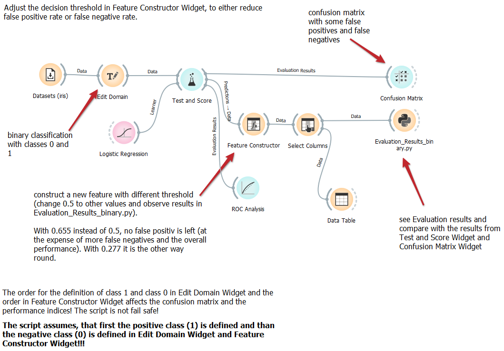
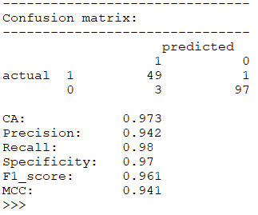

# Evaluation_Results_binary.py
Computes a confusion matrix and the performance criteria 
- CA
- Precision
- Recall
- Specificity
- F1_score and
- MCC (Matthews correlation coefficient; https://en.wikipedia.org/wiki/Phi_coefficient)

for a binary classification.

When a learner is used to make binary classification, and when a custom decision threshold (other than 0.5) is calculated with 
feature construction widget, this script can be used to display the performance.
A custom decision theshold is sometimes desireable, when one type of wrong classification (either false positives or false negatives) 
is prefered over the other. 

doc-string:

```
* Widget input: data
    - predicted values as metas (and only this column in metas!)
    - target
    (use Select Columns Widget to shape the data accordingly)

    Classes in target and predicted must be 1 for positiv and 0 for negative class!
    Data may or may not contain features.

* Widget output: 
    - no output, results are printed in this Widget.

* Computes Confusion matrix and some more Evaluation results
  out of data with predicted values and target.
* Mainly, if predicted values are generated with Feature
  Constructor Widget with a special Threshold.
* Only for binary classification.

```

The script has no setting.

## Usage in the canvas



In this example, the iris-dataset is used. To do a binary classification, we want to distinguish between iris-virginica (positive class, 1 in Edit Domain Widget) and the other flowers (negative class, 0 in Edit Domain Widget). We can use Test and Score Widget and Confusion Matrix Widget to show the results of the classification. We get 3 false positives, 3 flowers, which are classified as iris-virginica, but are actually another iris. 


Of course the Evaluation_Results_binary.py come to the same results.



If for our application it is necessary, to avoid false positives (also if this means, that we get more classification errors overall), we can use the trained classifier, use the calculated probabilities for the positiv class (which are stored in the metas as "Logistic Regression (1)" after Test and Score) and compute a new output with a different decision threshold. 

As standard, if the probability for the positiv class is higher than 0.5, the positiv class is predicted. In Feature constructor, we create a new feature "New Virginica" with a custom decision threshold. With Select Columns, the newly created feature becomes a meta. And the other former metas are ignored.


With this preparation, Evaluation_Results_binary.py computes a new canfusion matrix and performance criteria. If we use 0.655 for the decision threshold in Feature Constructor Widget, than we get zero false positives, but more false negatives instead. The total number of missclassifications are higher than the standard from above. But if it's very important to get no false positives in our predictions, we can construct our custom output and we can use Evaluation_Results_binary.py to show the performance criteria.


