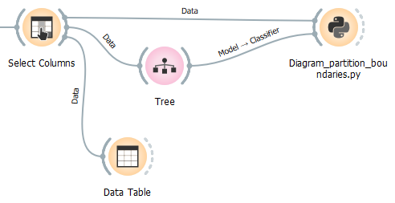
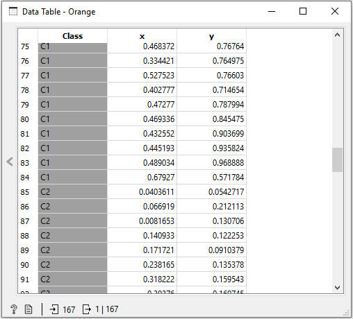
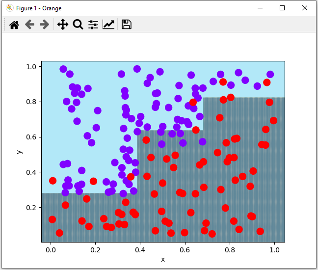
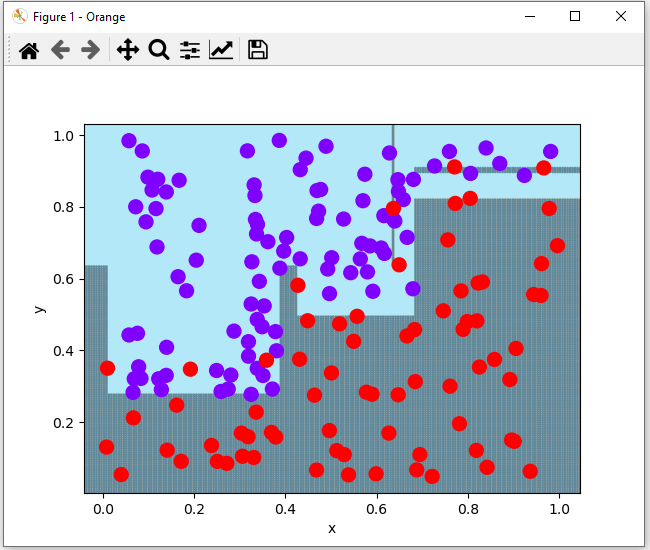

# Diagram_partition_boundaries.py

doc-string:
```
* Widget input: 
- data with two numerical features, one categorical target
- trained model on classifier input

* Widget output: -

Usage:
* to visually show partition boundaries and over-/underfitting


adapted from:
Python Data Science Handbook – Essential Tools for Working with Data
ISBN 978-1491912058, 2017, from Jake VanderPlas

```

There are no settings for this script.

## Usage in the canvas



## Data



## Setting in tree widget: Limit the maximal tree depth to: 4



## Setting in tree widget: Limit the maximal tree depth to: 6
(with some overfitting)


