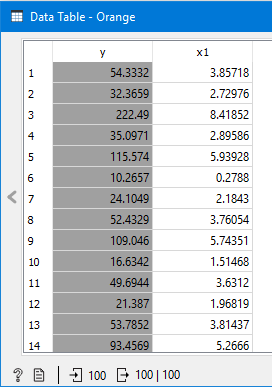
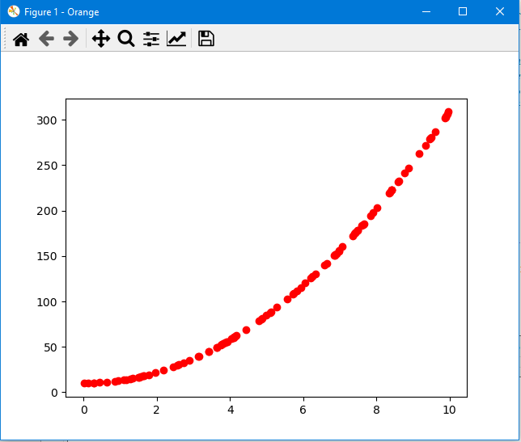

# Diagram_target_predictions.py

doc-string:
```"""
Widget input: data with one or two numerical features, numerial target and (optional) one or 
several predictions, stored as metadata
Widget output: -

Usage:
* Show numerical data with target and one feature in a scatterplot together with predicted data
* Show numerical data with target and two features in a 3D-scatterplot together with predicted data
* Predictions can be shown as dots or as line in 2D- and as surface in 3D-plots.

"""
```

Usage in the canvas


Some examples with 2D-data.



## meta_data = False
```
#################################
# Settings:
metadata = False             # False  if metadata/predictions 
                               should not be shown
#                              True   if metadata/predictions 
                               should be shown
enforce_2D = False           # True   if 2D-diagram should be 
                               shown, although 
#                              two dimensions (features) are 
                               available in input data
scatter_prediction = True    # True -> dots, False -> lines 
                               for metadata/predictions 
#                              in 2D-diagram
prediction_model = 1         # Standard 1 for 1 column of 
                               predictions in metadata or
#                              first column of predictions; 
#                              otherwise number of column, 
                               whose predictions should be shown
#####################################################

```

Only the input data, no predictions (which are stored as metadata) are shown. In the graphics window, it is possible to save the diagram (in different formats), to edit title, axis-label, scale and to zoom.



