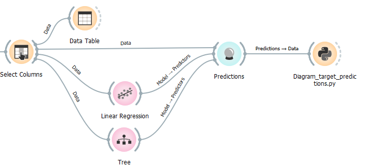

# Diagram_target_predictions.py

doc-string:
```"""
Widget input: data with one or two numerical features, numerial target and (optional) one or 
several predictions, stored as metadata
Widget output: -

Usage:
* Show numerical data with target and one feature in a scatterplot together with predicted data
* Show numerical data with target and two features in a 3D-scatterplot together with predicted data
* Predictions can be shown as dots or as line in 2D- and as surface in 3D-plots.

"""
```

Usage in the canvas



