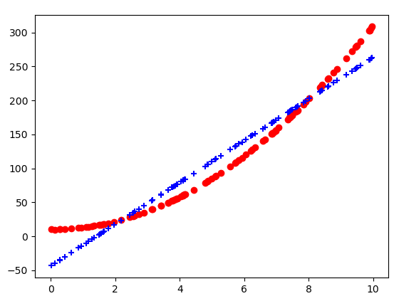
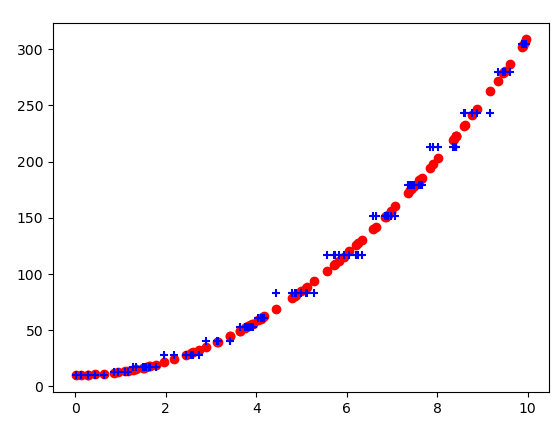
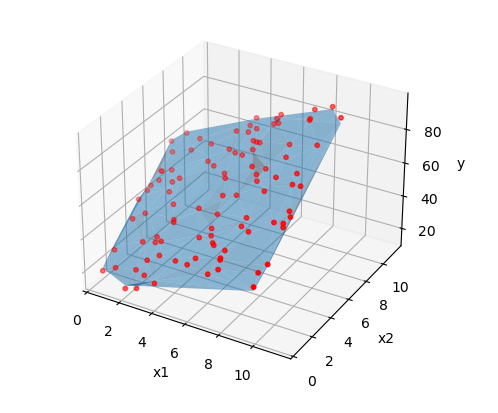
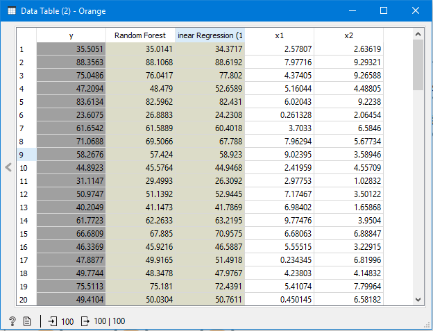

# Diagram_target_predictions.py
Plots numerical data or data together with predictions in a 2D or 3D-diagram.

doc-string:
```
Widget input: data with one or two numerical features, numerial target and (optional) one or 
several predictions, stored as metadata
Widget output: -

Usage:
* Show numerical data with target and one feature in a scatterplot together with predicted data
* Show numerical data with target and two features in a 3D-scatterplot together with predicted data
* Predictions can be shown as dots or as line in 2D- and as surface in 3D-plots.

```

Settings:
```
#################################
# Settings:
metadata = False             # False  if metadata/predictions 
                               should not be shown
#                              True   if metadata/predictions 
                               should be shown
enforce_2D = False           # True   if 2D-diagram should be 
                               shown, although 
#                              two dimensions (features) are 
                               available in input data
scatter_prediction = True    # True -> dots, False -> lines 
                               for metadata/predictions 
#                              in 2D-diagram
prediction_model = 1         # Standard 1 for 1 column of 
                               predictions in metadata or
#                              first column of predictions; 
#                              otherwise number of column, 
                               whose predictions should be shown
#####################################################

```

## Usage in the canvas


## Some examples with 2D-data.


## meta_data = False
```
#################################
# Settings:
metadata = False             # False  if metadata/predictions 
                               should not be shown
#                              True   if metadata/predictions 
                               should be shown
enforce_2D = False           # True   if 2D-diagram should be 
                               shown, although 
#                              two dimensions (features) are 
                               available in input data
scatter_prediction = True    # True -> dots, False -> lines 
                               for metadata/predictions 
#                              in 2D-diagram
prediction_model = 1         # Standard 1 for 1 column of 
                               predictions in metadata or
#                              first column of predictions; 
#                              otherwise number of column, 
                               whose predictions should be shown
#####################################################

```

Only the input data, no predictions (which are stored as metadata) are shown. In the graphics window, it is possible to save the diagram (in different formats), to edit title, axis-label, scale and to zoom.


## metadata = True and prediction_model = 1

```
#################################
# Settings:
metadata = True             # False  if metadata/predictions 
                               should not be shown
#                              True   if metadata/predictions 
                               should be shown
enforce_2D = False           # True   if 2D-diagram should be 
                               shown, although 
#                              two dimensions (features) are 
                               available in input data
scatter_prediction = True    # True -> dots, False -> lines 
                               for metadata/predictions 
#                              in 2D-diagram
prediction_model = 1         # Standard 1 for 1 column of 
                               predictions in metadata or
#                              first column of predictions; 
#                              otherwise number of column, 
                               whose predictions should be shown
#####################################################

```

Predictions/Metadata from the first model are shown, too. 

__scatter_prediction = False__ would draw a line instead of crosses for the predictions. When the data is not sorted from min to max, crosses do look better.



## metadata = True and prediction_model = 2

```
#################################
# Settings:
metadata = True             # False  if metadata/predictions 
                               should not be shown
#                              True   if metadata/predictions 
                               should be shown
enforce_2D = False           # True   if 2D-diagram should be 
                               shown, although 
#                              two dimensions (features) are 
                               available in input data
scatter_prediction = True    # True -> dots, False -> lines 
                               for metadata/predictions 
#                              in 2D-diagram
prediction_model = 2         # Standard 1 for 1 column of 
                               predictions in metadata or
#                              first column of predictions; 
#                              otherwise number of column, 
                               whose predictions should be shown
#####################################################

```

Predictions/Metadata from the second model are shown. 



## One example with 3D-Diagram
## enforce_2D = False

```
#################################
# Settings:
metadata = True             # False  if metadata/predictions 
                               should not be shown
#                              True   if metadata/predictions 
                               should be shown
enforce_2D = False           # True   if 2D-diagram should be 
                               shown, although 
#                              two dimensions (features) are 
                               available in input data
scatter_prediction = True    # True -> dots, False -> lines 
                               for metadata/predictions 
#                              in 2D-diagram
prediction_model = 1         # Standard 1 for 1 column of 
                               predictions in metadata or
#                              first column of predictions; 
#                              otherwise number of column, 
                               whose predictions should be shown
#####################################################

```

If exactly two features are in the data and with __enforce_2D=False__, a 3D-diagram is shown.
With mouse actions, the diagram can be rotated and zoomed in.
With __metadata=False__, only the (red) data points are shown.



## Data for 3D-diagrams:



## Example flows
Example 1 - Polynomial Regression and Diagrams.ows
Example 2 - 3D-diagram.ows


