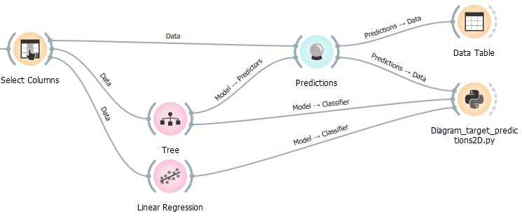
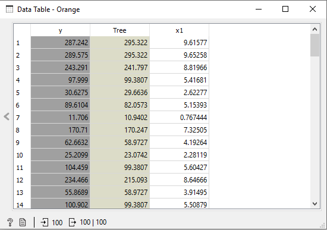
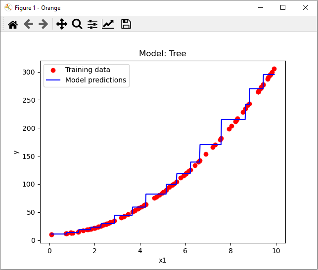
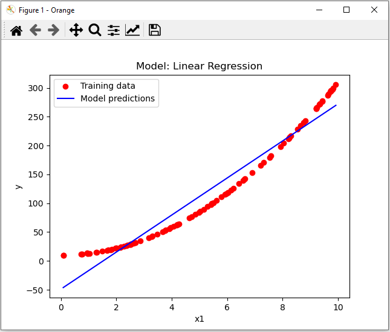

# Diagram_target_predictions2D.py
Plots numerical data together with predictions from a trained model in a 2D-diagram. Other than Diagram_target_predictions.py, a model must be connected and the predictions are shown in a continouus manner and not only for the known datapoints.

doc-string:
```
* Widget input: 
- data with one feature, one target and (mandatory) one prediction (or several predictions) in Metas, only numeric values
  e.g. from test and score widget or from predictions widget)
- trained model (or several trained models) on classifier input

* Widget output: -

Usage:
* to visually show prediction performance and over-/underfitting
```

Settings:
```
######################################################
# Settings:
prediction_model = 1         # Standard 1 for 1 connected model or the first connected model; 
#                              otherwise number of model, whose predictions should be shown
#####################################################
```


## Usage in the canvas



This script works only with 2D-data (with one feature, one target and (mandatory) one prediction (or several predictions) in Metas.



## prediction_model = 1

```
######################################################
# Settings:
prediction_model = 1         # Standard 1 for 1 connected model or the first connected model; 
#                              otherwise number of model, whose predictions should be shown
#####################################################
```



## prediction_model = 2

```
######################################################
# Settings:
prediction_model = 2         # Standard 1 for 1 connected model or the first connected model; 
#                              otherwise number of model, whose predictions should be shown
#####################################################
```




