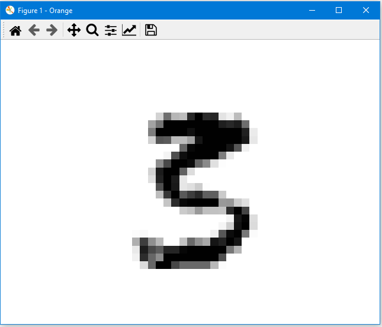

# Display_MNIST-Image.py

doc-string

```
* Widget input: data with (only) one instance of MNIST-data
* Widget output: -

Usage:
To visualize example data from MNIST (handwritten numbers)
* X-data should be in 784 features representing the pixels in the 28x28 matrix.
* Use Data Table Widget to select one row (and for example Confusion Matrix Widget in front of Data Table to select a group of instances).

```

The script has no settings.

Usage in the canvas


Data


Choose a subset of (eg. misclassified data) in confusion matrix. 
(Here, the subset of instances, which are actual a 3 but are misclassified as 5, are selected.)


Choose one row 


Image is shown in graphics window




