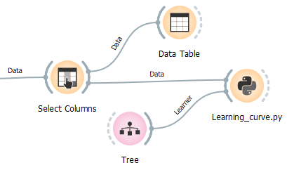
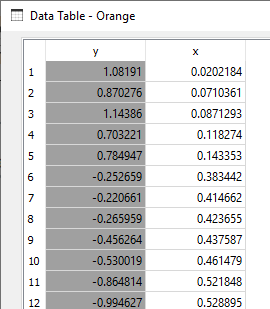
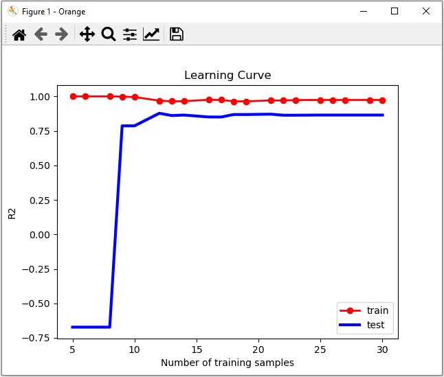

# Learning_curve.py

doc-string:
```
* Widget input: data and one learner
* Widget output: -

* Computes and shows learning curve for connected (1) learner.
* Scores are CA (classification accuracy) for classification and R_squared (R2) or RMSE for regression.
* Uses (variable) train-test-split, no cross validation.
* Can throw an error, if connected learner is not compatible with type of class variable (numeric or categorical). 
  Just connect a suitable learner.

```
Settings:
```
#############################################################
# Settings:
problem = "reg"             # "class": classification or "reg": Regression
score = "R2"                # "R2" or "RMSE"; only for regression
m = 20                      # number different training sizes
save_results = False        # True: save Excelfile with results; False: don't save
file_path = "E:/Downloads/" # file path for save_results
#                             e.g. "E:/Downloads/" - with slash (!) also in Windows (and trailing slash)
#############################################################
```

## Usage in the canvas



## Data



## Result


