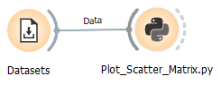
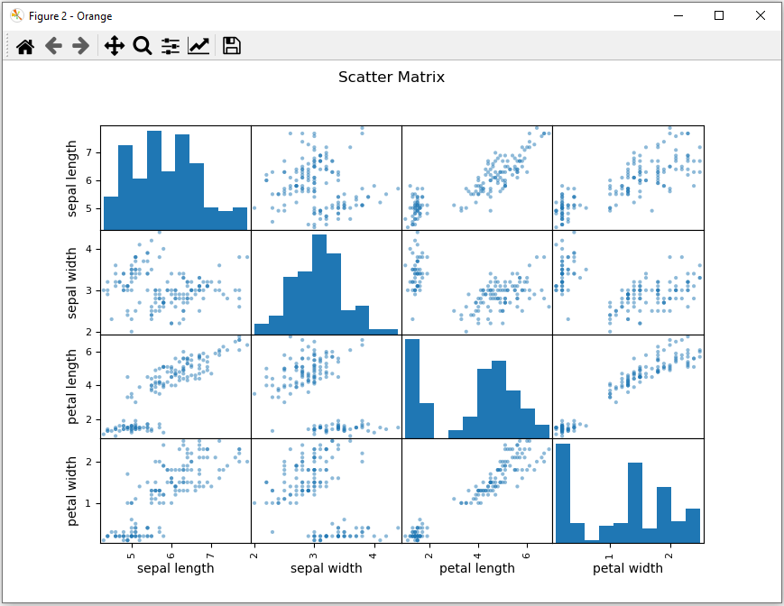

# Plot_Scatter_Matrix.py 
Plots a scatter matrix to see distribution and correlation of features.

doc-string:
```
* Widget input: data with (not too many) numerical features
* Widget output: -

Usage:
* Show a scatter matrix plot to see distribution and correlation of features
```
The script has no setting.

## Usage in the canvas



## Result



## Example flow
Example 6 - Plot Scatter Matrix.ows
