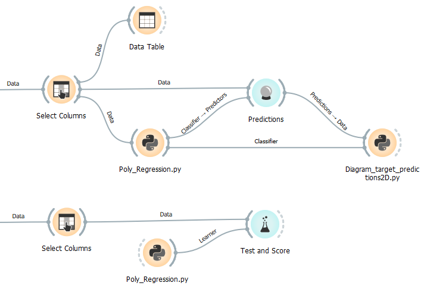

# Poly_Regression.py
Creates learner (and trained model) for polynomial regression to model nonlinear functions. (see also [polynomial regression in wikipedia](https://en.wikipedia.org/wiki/Polynomial_regression))


doc-string:

```
* Widget input: 
    - (optional) data 
    - (optional) preprocessors on object-input

* Widget output: 
    - learner on learner-output, if no data on input
    - learner on learner-output and trained model on classifier-output, if data on input

* Creates a learner for polynomial regression, which can be used e.g. in Test and Score-Widget
* Additionally creates a trained model, if training data is connectet to data-input, e.g. for Predictions-Widget
```

Settings:
```
########################################################
# Settings:
name="Linear Regression, deg=3"  # Name of the learner/model in other widgets, e.g. Test and Score
degree = 3                # maximal degree of the polynomial features
fit_intercept = True      # 
type = "0"                # 0: ordinary Least square 
                          # 1: Lasso (L1-Regularization)
                          # 2: Ridge (L2-Regularization)
alpha = 0.0001            # parameter alpha for L1- and L2-Regularization only
########################################################

```

## Usage in the canvas
1. to train a model
2. to specify a learner



## Data


## Result
as shown by Diagram_target_predictions2D.py:


as shown by Test and Score Widget in the second flow:


## Example flows
Example 1 - Polynomial Regression and Diagrams.ows

Example 2 - 3D-diagram.ows
