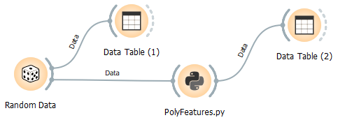

# PolyFeatures.py
Creates additional features as polynomial combinations of the input features (to use linear regression for modeling nonlinear functions).

docstring:

```
* Widget input: data (only numerical features are used; categorical features are filtered out)
* Widget output: data with additinal features, generated as polynomial combinations of the features

Usage:
* Create additional features to use linear regression for modeling nonlinear functions
* Use to show the effect of model complexity on overfitting the data
```

Settings:
```
###########################################################
# Settings:
degree = 2     # maximum degree of the polynomial features
###########################################################
```


## Usage in the canvas



## Data befor transformation with PolyFeatures


## Data after transformation with PolyFeatures
with the following settings
```
###########################################################
# Settings:
degree = 2     # maximal degree of the polynomial features
###########################################################
```


Three additional features, generated as polynomial combinations of the two original features.

## Application: To show, what Poly_Regression.py does under the hood
See also [Poly_Regression.py](https://github.com/EKal-aa/orange-support-files/blob/main/doc/poly_regression.md)


Data after transformation with PolyFeatures
with the __degrees = 3__


