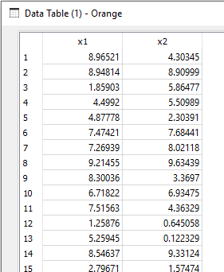

# PolyFeatures.py

docstring

```
* Widget input: data (only numerical features are used; categorical features are filtered out)
* Widget output: data with additinal features, generated as polynomial combinations of the features

Usage:
* Create additional features to use linear regression for modeling nonlinear functions
* Use to show the effect of model complexity on overfitting the data

```

Usage in the canvas


## Data befor transformation with PolyFeatures



## Data after transformation with PolyFeatures
with the following settings
```
###########################################################
# Settings:
degree = 2     # maximal degree of the polynomial features
###########################################################
```


Tree additional features, generated as polynomial combinations of the two original features.


