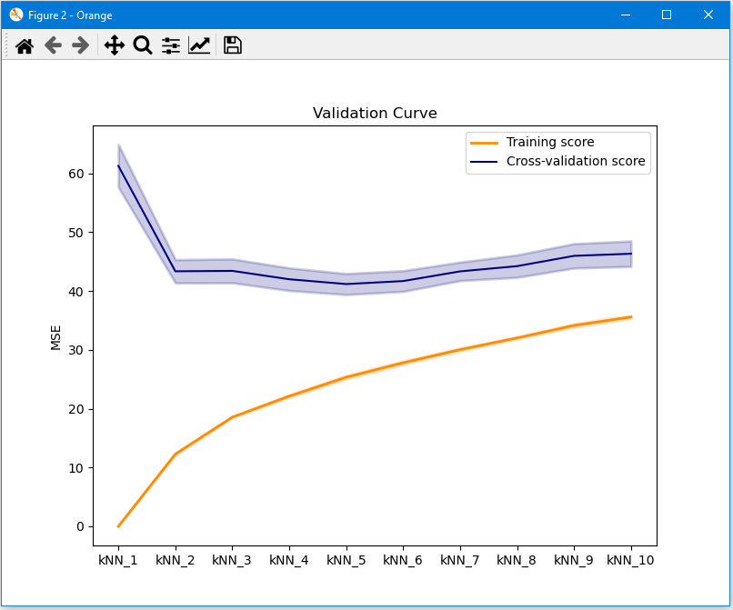

# Validation_curve.py
Plots a validation curve with training- and cross validation score to compare different learner settings.
Also the standard errors of the scores a indicated. (see also [validation curve in sklearn](https://scikit-learn.org/stable/modules/learning_curve.html#validation-curve))

doc-string:

```
* Widget input: data and some learners
* Widget output: -

* Computes and shows validation curve for connected learners out of cross validation.
* Uses standard error to indicate variability of the results.
* Scores are CA (classification accuracy) for classification and R_squared (R2) or RMSE for regression.
* Uses names of connected learners as x-labels.

Usage: 
* mainly to compare different learner settings for manual hyper parameter optimization.
* e.g. several learners of the same type, but with different values of a certain hyper parameter
* Use name in learner widget to indicate different learners

```

Settings:

```
##########################################################################
# Settings:
k = 5                       # number of folds
problem = "reg"             # "class": classification or "reg": Regression
score = "MSE"               # "R2" or "MSE"; only for regression
save_results = False        # True: save Excelfile with results; False: don't save
file_path = "E:/Downloads/" # file path for save_results
#                             e.g. "E:/Downloads/" - with slash (!) also in Windows (and trailing slash)
replicable = False          # WARNING: if using replicable=True, make sure to use shuffled data!
###########################################################################

```

## Usage in the canvas
It is possible to realise a variation of hyperparameters (as shown here; number of neighbors is varied) to produce a validation curve. It is also possible to just compare some different learners, e.g. linear regression, kNN and AdaBoost,  in the diagram. 

In the diagram, the names of the learners as defined in the learner widget are used.


## score = "R2"


## score = "MSE"



## problem = "class"

For classification problems, classification accuracy (CA) is used as performance criterion in the diagram.

## save results = True

With __save_results = True__ and defining the path __file_path = "E:/Downloads/"__ it is possible to save an excel file with the numerical results.

## replicable = True

With __replicable = False__ the data is shuffled in the script. 

With __replicable = True__ the data is not shuffled, so that several runs of the script give the same results. Make sure that the data is shuffled, before it is used in the script!
