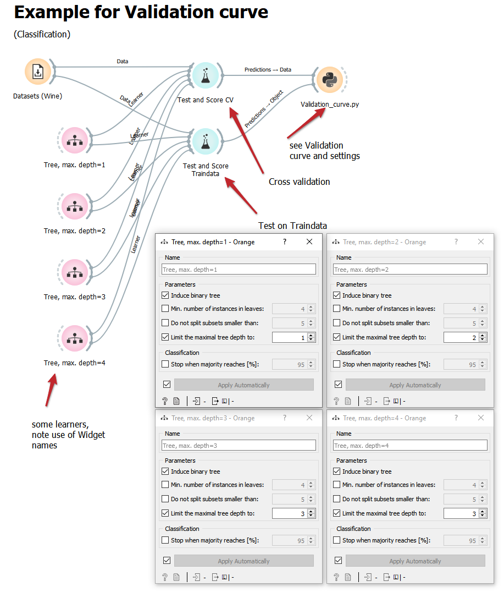
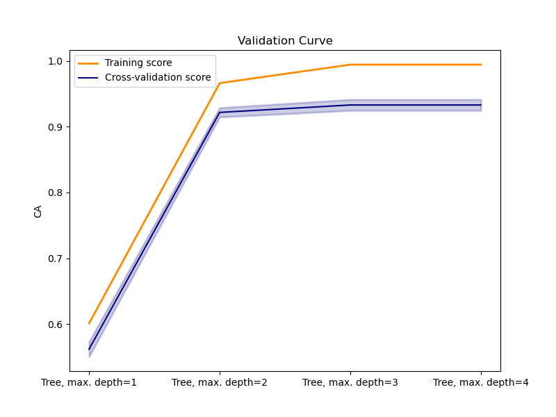

# Validation_curve.py
Plots a validation curve with cross validation score (and optional with test on train data score) to compare different learner settings.
Also the standard errors of the scores are shown. (see also [validation curve in sklearn](https://scikit-learn.org/stable/modules/learning_curve.html#validation-curve))
Uses the Predictions output of Widget Test and Score.

doc-string:

```
* Widget input: Predictions from Test & Score with Cross validation
  and optional: Predictions from Test & Score with test on training data
* Widget output: Diagram and text in the console window of Widget

* Computes and shows validation curve for learners out of cross validation by Widget Test & Score
* Uses standard error to indicate variability of the results.
* Scores are CA (classification accuracy) for classification and R_squared (R2) or MSE for regression.
* Uses names of learners as x-labels.

Usage: 
* mainly to compare different learner settings for manual hyper parameter optimization.
* e.g. several learners of the same type, but with different values of a certain hyper parameter
* Use name in learner widget to indicate different learners

```

Settings:

```
#######################
# Settings:
score = "MSE"                # "R2" or "MSE"; only for regression
save_results = False        # True: save Excelfile with results; False: don't save
file_path = "E:/Downloads/" # file path for save_results
#                             e.g. "E:/Downloads/" - with slash (!) also in Windows (and trailing slash)
#####################################################

```

## Usage in the canvas
It is possible to realise a variation of hyperparameters (as shown here; max. tree depth is varied) to produce a validation curve. It is also possible to just compare some different learners, e.g. linear regression, kNN and AdaBoost,  in the diagram. 

Use one Test & Score Widget with Cross validation and connect it to the Data input of Validation curve Widget. 

(Optional) Use another Test & Score Widget with Test on Traindata and connect it to the Object input of Validation curve Widget. 

In the diagram, the names of the learners as defined in the learner widget are used.



## For classification, the Classification Accuracy (CA) is shown
(In this example, one can see, that for max dapth of trees, a higher number as 2 increases only the performance on the training data, but not the (more important) performance in cross validation.)



The text window of the Widget displays the exact numbers of performance criteria and also the standard error:
```
---------------------------
Results of Cross validation
---------------------------
Number of instances:  178
Number of folds    :  5

               Models        CA     CA-se  CA_train
0  Tree, max. depth=1  0.561905  0.011286  0.601124
1  Tree, max. depth=2  0.921746  0.007141  0.966292
2  Tree, max. depth=3  0.933016  0.008406  0.994382
3  Tree, max. depth=4  0.933016  0.008406  0.994382
```


For classification problems, classification accuracy (CA) is used as performance criterion in the diagram. For regression problems, one can select R2 or MSE als performance criteria in the diagream.

## save results = True

With __save_results = True__ and defining the path __file_path = "E:/Downloads/"__ it is possible to save an excel file with the numerical results. Use __(forward) slash__ in the path and a slash at the end of the path also in Windows (no backslash).


## Example flow
Example 4a - Validation Curve.ows (with a classification problem)

Example 4b - Validation Curve.ows (with a regression problem)
